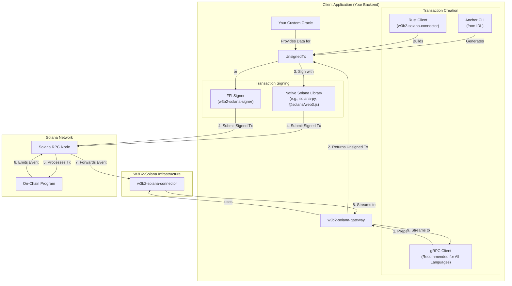

# W3B2-Solana: The Easiest Way to Connect Your Existing Service to the Solana Blockchain.

W3B2-Solana is a toolset for developers integrating existing services with the Solana blockchain. Its core philosophy is to use the blockchain not as a general-purpose database, but as a **secure, verifiable message bus**. This approach allows you to build backend services that listen for on-chain events and react to them, creating a powerful bridge between Web2 and Web3.

Instead of forcing all application logic onto the chain, this model uses the chain for what it does best:
- **Verifiable State Transitions**: Securely managing ownership, payments, and permissions.
- **Audit Trail**: Emitting events that serve as an immutable log of critical actions.

Your backend services can then consume these events to trigger complex, high-throughput, or private off-chain actions.

## Architecture Overview

W3B2-Solana provides a complete, bidirectional architecture for interacting with the on-chain program. You can both listen for events and submit transactions through a flexible set of tools designed to accommodate any backend language.

The recommended approach for all developers, including those using Rust, is to use the `w3b2-solana-gateway`. It provides a comprehensive gRPC interface for all on-chain operations, allowing you to focus on your application's logic instead of the low-level details of Solana integration.

The diagram below illustrates the complete interaction flow, from transaction creation to event reception.



### Key Interaction Points

1.  **Transaction Creation**:
    -   **gRPC Gateway (Recommended)**: The `w3b2-solana-gateway` provides `prepare_*` methods for every on-chain instruction. Your client calls these methods to get a serialized, unsigned transaction message. This is the simplest and most robust method.
    -   **`w3b2-solana-connector` (Rust)**: If you are building a native Rust service, you can use the `TransactionBuilder` in the connector library directly for maximum control.
    -   **Anchor CLI**: For manual testing or scripting, you can generate instructions directly from the on-chain program's IDL.

2.  **Oracle & Signing**:
    -   Your custom **Oracle** is responsible for providing any necessary off-chain data and logic (e.g., pricing, validation) required for a transaction.
    -   The unsigned transaction must be signed by the user's keypair. You can use a **native Solana library** in your language or, as a fallback, the **`w3b2-solana-signer`** FFI library if a native option is unavailable or you cannot easily deserialize the transaction message.

3.  **Submission & Event Streaming**:
    -   The signed transaction is sent to a Solana **RPC Node**.
    -   The on-chain **Program** processes the transaction and emits an event.
    -   The **Connector** listens for this event and streams it through the **Gateway** back to your **gRPC Client**.

### How the Secure Handshake Works
For high-traffic services, the architecture above supports a "secure handshake" pattern. The on-chain program provides the instruments for this secure negotiation:

- **communication_pubkey**: Both admins and users store a public key on-chain for secure, hybrid encryption.
- **dispatch commands**: The admin_dispatch_command and user_dispatch_command instructions contain a flexible payload field.

**The Flow:**
1. A party (e.g., the user) initiates a connection by calling a dispatch command.
2. The payload of this command contains a connection configuration, encrypted for the recipient using their on-chain communication_pubkey.
3. The recipient's backend service, listening for on-chain events via the w3b2-solana-connector, receives this encrypted config.
4. After decrypting the config, the service can establish a direct, off-chain connection (e.g., a WebSocket, TCP socket) with the user, completely bypassing the blockchain for the actual data transfer.

The `w3b2-solana-program/src/protocols.rs` file provides a reference implementation for a configuration payload, but developers are free to implement any protocol they need.

## Crate Overview

This workspace provides the tools to build this architecture:

-   `w3b2-solana-program`: The core on-chain Anchor program that manages state and emits events.
-   `w3b2-solana-gateway`: A ready-to-use gRPC server that streams on-chain events. **This is the recommended entry point for non-Rust services.**
-   `w3b2-solana-connector`: A Rust library for building off-chain services. It provides the core logic for the gateway and can be used directly for native Rust development.
-   `w3b2-solana-signer`: A C-ABI compatible library for signing messages from any programming language, useful for building oracles.
-   `w3b2-solana-logger`: A simple logging utility for the Rust services.

> **Note**: For detailed guides, API references, and architecture diagrams, please see the **Full Documentation Site**.

## Local Development with Docker

The recommended development environment is managed via Docker and Docker Compose. For the best onboarding experience, we recommend starting the documentation server first to explore the project's concepts and API references in detail.

```bash
docker compose --profile docs up
```

See the full documentation for details on getting started with other services.

!!! warning "Alpha Version"

    Please be aware that this project is currently in an early development stage. The API is not yet stable and is subject to breaking changes without notice.

    You are welcome to experiment with the software, but we strongly advise against using it in production environments at this time. We greatly appreciate any feedback and contributions
