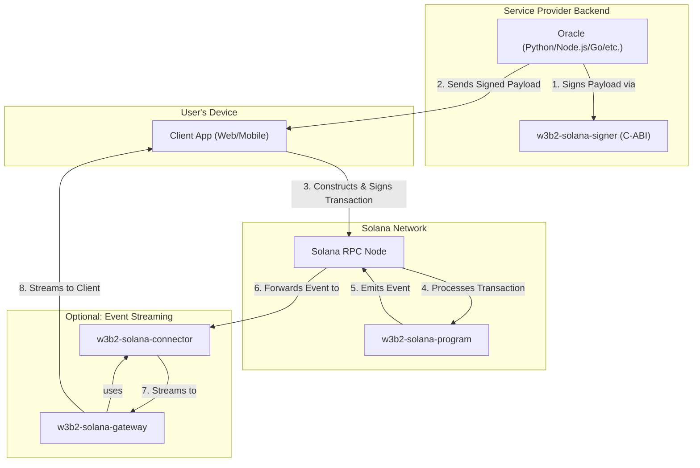

# W3B2-Solana: A Toolset for Hybrid On-Chain/Off-Chain Services

W3B2-Solana provides a collection of interoperable Rust crates for building services that bridge traditional off-chain infrastructure with the Solana blockchain. The toolset is designed for developers who need to integrate specific on-chain functionality—such as payments, verifiable logging, or state management—into existing applications without migrating their entire stack.

The core philosophy is the **"developer-owned oracle"** pattern. In this model, the service provider is responsible for running an off-chain oracle that signs business-critical data (e.g., API usage, payment amounts, event outcomes). This signature is then consumed by the client, which includes it in a transaction sent to the on-chain program. The program verifies the oracle's signature, ensuring that the action is authorized by the service provider, while the user retains final control over their assets and data via their own signature.

> **Note**: This `README.md` provides a high-level overview. For detailed guides, API references, and architecture diagrams, please see the **Full Documentation Site**. Instructions to run it locally are in the [Local Development](#local-development-with-docker) section.

## High-Level Architecture

The system consists of a core on-chain program and several off-chain crates that facilitate interaction with it.

-   **On-Chain Program (`w3b2-solana-program`)**: The Anchor-based smart contract that serves as the single source of truth for all on-chain state and logic.
-   **Service Provider Backend / Oracle**: An off-chain service, run by the developer, that signs data payloads. It can be written in any language.
-   **Client Application**: The end-user's application (e.g., web, mobile) that constructs and signs transactions. It interacts directly with the Solana network.
-   **Signer (`w3b2-solana-signer`)**: A C-ABI compatible library that allows non-Rust backends (e.g., Python, Node.js, Go) to sign messages using a Solana keypair, enabling them to act as oracles.
-   **Gateway (`w3b2-solana-gateway`)**: An optional gRPC server that provides a real-time stream of on-chain events emitted by the program.



## Crate Overview

This workspace contains the following crates:

-   `w3b2-solana-program`: The core on-chain Anchor program.
-   `w3b2-solana-connector`: A Rust library for interacting with the on-chain program and listening to events. Used by the gateway and other Rust-based backends.
-   `w3b2-solana-gateway`: A standalone gRPC gateway that streams on-chain events to clients.
-   `w3b2-solana-signer`: A C-ABI compatible library for signing Solana messages from any programming language. Essential for building oracles in non-Rust environments.
-   `w3b2-solana-logger`: A simple library for logging events to the blockchain.

## Local Development with Docker

The recommended development environment is managed via Docker and Docker Compose.

> **Note:** The repository does **not** include any private keys. You must provide your own Solana program keypair.

### Prerequisites

*   Docker & Docker Compose

### Quickstart

1.  **Generate a Program Keypair**: The build process requires a keypair for the on-chain program. The `builder` service includes the Solana CLI for this purpose.
    ```bash
    # This creates ./keys/program-keypair.json on your host machine
    docker compose run --rm builder solana-keygen new --outfile /keys/program-keypair.json
    ```

2.  **Build and Run Services**: Use Docker Compose profiles to manage the stack. To build the program, start a validator, deploy the program, and run the gateway:
    ```bash
    # This builds and runs the 'builder', 'validator', 'deployer', and 'gateway' services
    docker compose --profile '*' up --build
    ```

3.  **Run the Documentation Site**: The MkDocs documentation site can be served locally.
    ```bash
    docker compose --profile docs up
    ```
    Once started, you can access the documentation site at `http://localhost:8000`.