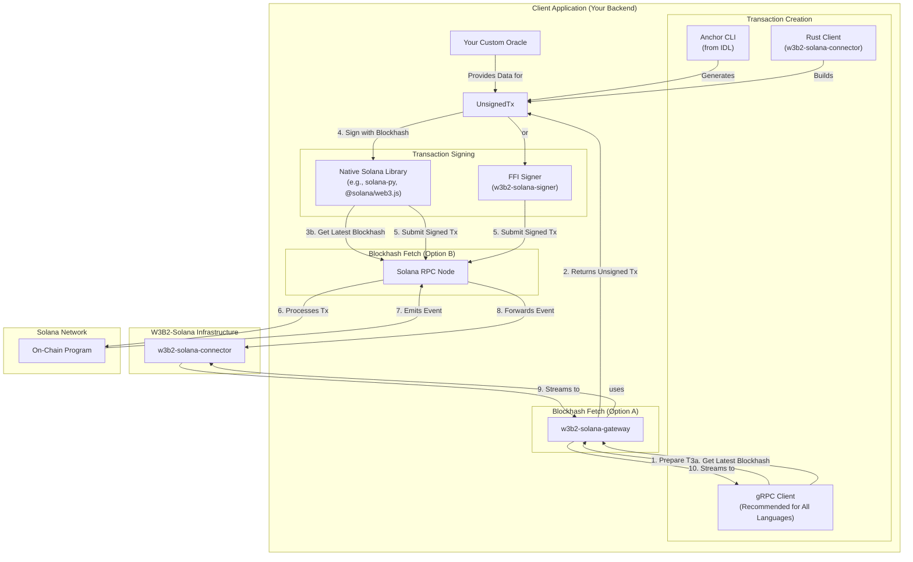

# W3B2-Solana

W3B2-Solana is a Rust-based toolkit for integrating existing Web2 backend services with the Solana blockchain. Its core purpose is to use the blockchain as a **secure, verifiable message bus** rather than as a primary database. This allows you to connect your traditional services to Web3 capabilities without a complete architectural overhaul.

## Core Logic: Blockchain-First Integration

The system is designed around a **blockchain-first** security model. It does **not** expose a traditional, public-facing API endpoint. Instead, all interactions are initiated on-chain, and your backend service acts as a listener, reacting to verified blockchain events. This fundamentally shifts the security paradigm: your service's entry point is the secure and verifiable Solana network, not a mutable API that must be defended.

### Security Model: No Public API

This architecture provides key security advantages:

*   **No Public Attack Surface**: Since there is no public API endpoint, your service is not exposed to common web-based attacks like DDoS or unauthorized API requests.
*   **On-Chain Authorization**: Every action is pre-authorized on the blockchain. Your backend only acts on commands that have already been verified and paid for according to the on-chain rules.
*   **Secure Handshake**: For high-traffic, real-time interactions, the on-chain transaction serves as a secure, one-time handshake. Once verified, your service can grant the user credentials for a direct, off-chain communication channel (e.g., a WebSocket or dedicated gRPC stream), keeping high-frequency traffic off the blockchain while retaining initial on-chain security.

The entire process is managed through two key on-chain accounts created by the `w3b2-solana-program`:

1.  **AdminProfile**: An on-chain account that stores the service provider's configuration, such as public keys and the oracle address.
2.  **UserProfile**: An on-chain account for each end-user. It holds their non-custodial deposit and manages their status.

The workflow is as follows:
1.  A user deposits funds into their `UserProfile`. Your service listens for this on-chain event via the `w3b2-solana-gateway` and recognizes the user.
2.  To use a service, a transaction is authorized on-chain. Your service receives this authorized command as an event.
3.  For high-throughput needs (e.g., data streams, game sessions), the on-chain command can serve as a secure handshake. After the blockchain grants approval, your service provides the user with credentials for a direct, off-chain connection (like a WebSocket), bypassing the blockchain for heavy traffic.

This hybrid model uses the blockchain for secure authorization and coordination, while using your traditional infrastructure for performance-intensive tasks.

## Architecture

The diagram below shows the interaction flow between the components.



## W3B2-Solana Components

### w3b2-solana-program: The On-Chain Logic

| Aspect             | Description                                                                                                                                                           |
| ------------------ | --------------------------------------------------------------------------------------------------------------------------------------------------------------------- |
| **Primary Purpose**| Acts as the source of truth, manages on-chain state, enforces payment rules, verifies oracle signatures, and emits events.         |
| **Target User**    | The foundational layer used by the off-chain connector and gateway components, not end-developers.               |
| **Architectural Role**| The core on-chain smart contract that all off-chain components interact with.                                           |

The `w3b2-solana-program` is the main on-chain smart contract, built with the Anchor framework. It functions as the system's financial arbiter, and its actions are publicly verifiable on the Solana ledger.

Key responsibilities:

*   **State Management**: Creates and manages `AdminProfile` and `UserProfile` Program-Derived Addresses (PDAs). These accounts are controlled by the program, not a single private key.
*   **Rule Enforcement**: Enforces non-custodial payment rules. A service provider cannot withdraw funds from a user's account without an authorized, oracle-verified command from the user.
*   **Security & Verification**: Verifies cryptographic signatures from an off-chain oracle, allowing for off-chain business logic (like pricing) while maintaining on-chain security.
*   **Event Emission**: Emits a detailed event for every significant action (deposit, payment, etc.), creating an immutable audit trail.

### w3b2-solana-gateway: The gRPC Interface

| Aspect      | Description                                                                                                                                                                   |
| ----------- | ----------------------------------------------------------------------------------------------------------------------------------------------------------------------------- |
| **Primary Purpose**| A gRPC server that streams on-chain events and prepares unsigned transactions, simplifying Solana RPC node interaction. |
| **Target User**    | Developers building backend services in non-Rust languages (e.g., Python, Node.js, Go, C#). This is the recommended entry point.                            |
| **Architectural Role**| A language-agnostic entry point for listening to on-chain events and preparing unsigned transactions via gRPC.                                                  |

The `w3b2-solana-gateway` is a gRPC server that provides an interface to the on-chain program. It is the recommended entry point for non-Rust services as it simplifies Solana interaction.

The gateway has two main functions:

1.  **Preparing Transactions**: Provides `prepare_*` methods for each on-chain instruction. Your client calls the gRPC method, and the gateway constructs and returns the unsigned transaction message. The client then signs it locally and submits it.
2.  **Streaming Events**: Makes on-chain events available to any backend service through two stream types:
    *   **History Stream (`Get...EventHistory`)**: A one-shot stream that fetches all historical events for an account. Used to build initial state.
    *   **Live Stream (`Stream...LiveEvents`)**: A persistent stream that forwards new events in real-time.

The gateway also provides an endpoint to get the **latest blockhash**, which is needed just before signing to ensure the transaction is valid. The gateway is powered by the `w3b2-solana-connector`.

### w3b2-solana-connector: The Rust Library

| Aspect      | Description                                                                                                                                |
| ----------- | ------------------------------------------------------------------------------------------------------------------------------------------ |
| **Primary Purpose**| A high-level, async Rust library for building native off-chain services that listen for events and build transactions. |
| **Target User**    | Rust developers who need maximum control and performance.                       |
| **Architectural Role**| The underlying engine that powers the gateway and serves as the direct blockchain interface for native Rust applications. |

The `w3b2-solana-connector` is a Rust library for building backend services that interact with the on-chain program. It contains the core logic for communicating with the Solana network and powers the gateway. Using the connector directly provides the highest performance for Rust developers.

Key features:

*   **Event Handling**: Provides persistent event streams for both historical and live events. It uses local storage to track processed transactions, ensuring no data is missed if the service restarts.
*   **TransactionBuilder**: A utility for programmatically creating unsigned transaction messages. Useful for building off-chain services like oracles or admin tools.

### w3b2-solana-signer: The Signing Utility

| Aspect      | Description                                                                                                                                           |
| ----------- | ----------------------------------------------------------------------------------------------------------------------------------------------------- |
| **Primary Purpose**| A C-compatible Foreign Function Interface (FFI) for signing Solana transactions from non-Rust applications.               |
| **Target User**    | Developers using languages (e.g., Go, C++, Swift) that lack a mature native Solana signing library.               |
| **Architectural Role**| A fallback solution for signing transactions in specific tech stacks.               |

The `w3b2-solana-signer` crate is a tool that provides a C-compatible FFI, allowing applications in other languages to sign Solana transactions using Rust's cryptographic libraries. It includes security features like locking private keys in memory with `mlock()`.

This is a **fallback solution**. It should be used only when a mature native Solana library is not available for your language. For languages like TypeScript or Python, use their native libraries (`@solana/web3.js` or `solana-py`).

### Component Summary

|                    | `w3b2-solana-program`                                                                                                      | `w3b2-solana-gateway`                                                                                                                                        | `w3b2-solana-connector`                                                                                                                               | `w3b2-solana-signer`                                                                                                                                  |
| ------------------ | -------------------------------------------------------------------------------------------------------------------------- | ------------------------------------------------------------------------------------------------------------------------------------------------------------ | ----------------------------------------------------------------------------------------------------------------------------------------------------- | ----------------------------------------------------------------------------------------------------------------------------------------------------- |
| **Analogy**        | On-Chain Logic                                                                                                      | gRPC Interface                                                                                                                                      | Rust Library                                                                                                                             | Signing Utility                                                                                                                            |
| **Core Function**  | Manages on-chain state, enforces payment rules, verifies signatures, and emits events.                                   | Streams on-chain events and prepares unsigned transactions over a gRPC interface.                 | Provides event handling and transaction building for native Rust services.                                                          | Signs Solana transactions via C-FFI for languages without mature native libraries.                                                                 |
| **When to Use It** | The mandatory on-chain foundation for all other components.                                       | The recommended method for any backend to listen for events and prepare transactions without needing native Rust tooling.                                  | When building a high-performance backend service, oracle, or admin tool in Rust.                                                                      | As a fallback when your language lacks a good native signing library.                                                                |

## Local Development

The development environment is managed with Docker and Docker Compose. To view the full documentation site locally, run:

```bash
docker compose --profile docs up
```

## API Status

Please be aware that the API is not yet standardized. You are welcome to use this repository as a foundation for your own projects.

## License

See the [LICENSE.md](https://github.com/m62624/w3b2-solana/blob/main/LICENSE.md) file for details.
