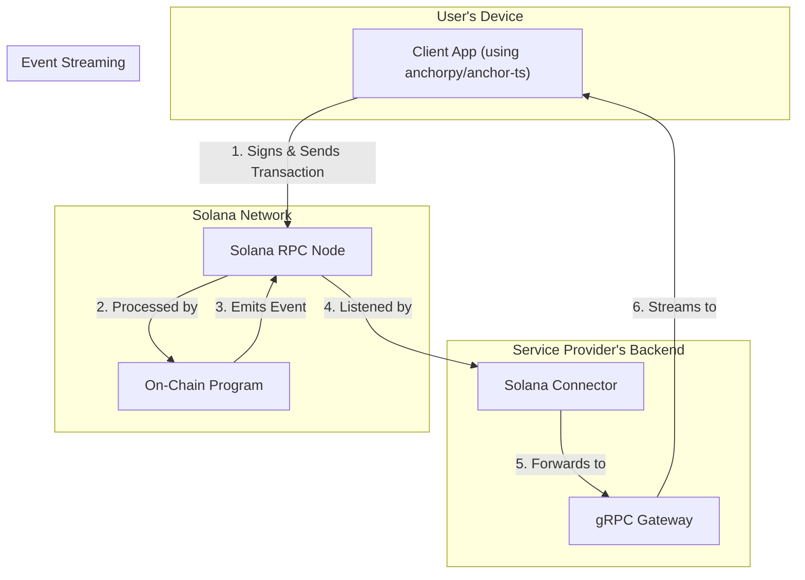

# W3B2: A Toolset for Solana-Based Services

W3B2 is a toolset for building services on the Solana blockchain that need to interact with traditional Web2 applications. It provides an on-chain smart contract for managing state and financial logic, a Rust library for backend integration, and a gRPC gateway for broader API access.

It is designed for developers who want to leverage the security and transparency of Solana for specific tasks without moving their entire application on-chain.

> **Note**: This `README.md` provides a high-level overview. For detailed guides, API references, and architecture diagrams, please see the **Full Documentation Site**, which you can run locally using the `docs` Docker profile.

## What Can You Do With This Toolset?

This project provides the foundation for a variety of hybrid Web2/Web3 use cases:

-   **Non-Custodial Paid APIs**: Charge users in SOL for API calls. Your backend oracle signs the price, and the user approves the payment with their wallet. The on-chain program guarantees the fund transfer.
-   **Verifiable Audit Trails**: Log critical off-chain actions (e.g., "User A deleted file B") to the Solana blockchain as an immutable, permanent record.
-   **User-Managed Deposits**: Allow users to pre-fund an account for your service. All funds remain under the user's control and can only be spent with their explicit, signed approval for a specific action.
-   **On-Chain User Management**: Implement on-chain banning/moderation systems that are transparent and enforced by the smart contract.

## High-Level Architecture

The system is composed of four main parts: the **Client**, the **gRPC Gateway**, the **Solana Connector**, and the **On-Chain Program**.

-   **Clients** (e.g., web apps, mobile apps) interact directly with the Solana network for transactions using standard libraries like `anchorpy` (Python) or `@coral-xyz/anchor` (TypeScript).
-   The **gRPC Gateway**'s sole responsibility is to provide a persistent, real-time stream of on-chain events to clients.
-   The **Solana Connector** is the underlying Rust library that powers the gateway's event listening capabilities.
-   The **On-Chain Program** is the Anchor smart contract that serves as the single source of truth.



## Local Development with Docker

This project provides a full Docker Compose pipeline for building, testing, and deploying all components. This is the recommended way to get started.

> **Note:** The repository does **not** include any private keys. You must provide your own Solana program keypair. All builds and deployments will use your Program ID, and all components will be built with this ID.

### Prerequisites

*   Docker & Docker Compose

### Quickstart

1.  **Generate a Program Keypair**: The build process requires a keypair for the on-chain program. Use the `builder` service to generate one.
    ```bash
    # This creates ./keys/program-keypair.json on your host
    docker compose run --rm builder solana-keygen new --outfile /keys/program-keypair.json
    ```

2.  **Run the Full Stack**: Use the `full` profile to build, deploy, and run all services.
    ```bash
    docker compose --profile full up --build
    ```

This command will:
-   Build the on-chain program and gateway.
-   Start a local Solana validator.
-   Deploy the program to the validator.
-   Run the gRPC gateway.
-   Serve the full documentation site.

Once started, you can access the **Full Documentation Site** to continue.