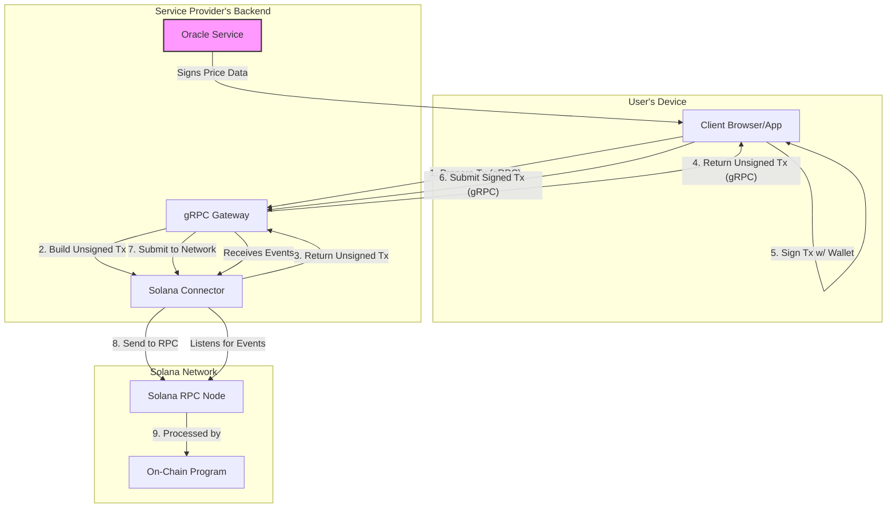

# System Architecture

This document describes the architecture of the W3B2 toolset, detailing how the different components interact to provide a secure, non-custodial bridge between a Web2 application and the Solana blockchain.

## Component Overview

The system is composed of four main parts: the **Client**, the **Gateway**, the **Connector**, and the **On-Chain Program**.

### 1. Client

The client is the user-facing part of your application (e.g., a web browser, a mobile app). Its key responsibilities are:
-   Interacting with the user's wallet (e.g., Phantom) to get their public key and request signatures.
-   Communicating with your backend (the gRPC Gateway) to prepare and submit transactions.
-   (For paid commands) Receiving signed data from your Oracle Service.

### 2. gRPC Gateway (`w3b2-solana-gateway`)

This is a ready-to-use gRPC service that acts as the primary API layer for your clients. It simplifies interaction with the blockchain by exposing a clear, language-agnostic API.
-   **Role**: Translates simple gRPC requests from the client into more complex blockchain operations using the Connector.
-   **Functionality**: Exposes methods to prepare unsigned transactions, submit signed transactions, and stream on-chain events.

### 3. Solana Connector (`w3b2-solana-connector`)

This is a low-level, asynchronous Rust library that forms the core of the backend logic.
-   **Role**: Handles all direct communication with the Solana network.
-   **Functionality**:
    -   `TransactionBuilder`: Constructs unsigned Solana transactions for each instruction in the on-chain program.
    -   `EventManager`: A robust system for listening to on-chain events. It fetches historical transactions to ensure state consistency and opens a WebSocket connection for real-time events.

### 4. On-Chain Program (`w3b2-solana-program`)

The Anchor-based smart contract that acts as the single source of truth.
-   **Role**: Enforces the rules of the system in a decentralized and verifiable manner.
-   **Functionality**:
    -   Manages `AdminProfile` and `UserProfile` PDAs.
    -   Secures all value transfer (deposits, payments).
    -   Verifies signatures from the user and the oracle.
    -   Emits events as a permanent record of all state changes.

## The Non-Custodial Transaction Flow

A core principle of the architecture is that the service provider's backend **never** handles private keys. The following sequence for a paid command (`user_dispatch_command`) illustrates this non-custodial flow.

#### **Phase 1: Oracle Signature (Off-Chain)**

1.  **User Action**: The user initiates a paid action in the client application.
2.  **Oracle Signs Data**: Your backend's **Oracle Service** (which you must implement) signs a message containing the `command_id`, `price`, and a `timestamp`.
3.  **Client Receives Signature**: The client receives the signature and the data that was signed.

#### **Phase 2: Transaction Preparation (Client -> Gateway -> Connector)**

4.  **Client Request**: The client sends a `PrepareUserDispatchCommand` gRPC request to the Gateway, including the data and signature from the oracle.
5.  **Gateway Builds Transaction**: The Gateway uses the `w3b2-solana-connector`'s `TransactionBuilder` to construct a Solana transaction. This transaction contains two crucial instructions:
    -   An `Ed25519` instruction to verify the oracle's signature on-chain.
    -   The `user_dispatch_command` instruction itself.
6.  **Gateway Responds**: The Gateway returns the **unsigned** transaction to the client, typically as a base64-encoded string.

#### **Phase 3: User Signature & Submission (Client -> Gateway -> Network)**

7.  **User Signs**: The client prompts the user to sign the transaction with their wallet. This signature authorizes the potential transfer of funds from their `UserProfile` PDA.
8.  **Client Submits**: The client sends the now-signed transaction back to the Gateway via the `SubmitTransaction` RPC method.
9.  **Gateway Submits to Network**: The Gateway uses the `connector` to send the transaction to a Solana RPC node for processing. The on-chain program validates both the oracle's signature and the user's signature before executing the instruction and transferring funds.

## The "Request for Review" Unban Model

The process for unbanning a user is intentionally asynchronous and requires admin intervention. A user pays an `unban_fee` to request a review, and an off-chain listener notifies the admin, who must then manually approve the unban by calling `admin_unban_user`.

This model was chosen over a simpler "pay-to-unban" atomic model for several key reasons:

1.  **Admin Sovereignty**: A ban is a disciplinary measure. If a user could automatically unban themselves, the ban would lose its meaning as a deterrent for malicious behavior (e.g., spam). The service administrator must have the final say.
2.  **Flexibility**: The current model allows the admin to unban a user for free (e.g., if the ban was an error) or to refuse an unban request even if the fee was paid.
3.  **Clear Separation of Concerns**: The smart contract's role is to act as an incorruptible financial arbiter. It verifiably records the facts: "Yes, the user paid the fee. Yes, they have requested a review." The final business decision remains off-chain, where it belongs.