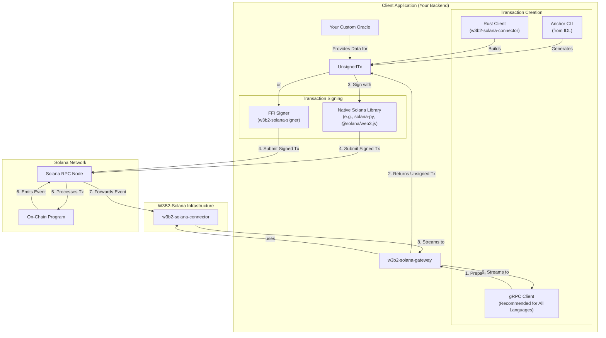

# Architecture Overview

W3B2-Solana provides a complete, bidirectional architecture for interacting with the on-chain program. You can both listen for events and submit transactions through a flexible set of tools designed to accommodate any backend language.

The recommended approach for all developers, including those using Rust, is to use the `w3b2-solana-gateway`. It provides a comprehensive gRPC interface for all on-chain operations, allowing you to focus on your application's logic instead of the low-level details of Solana integration.

The diagram below illustrates the complete interaction flow, from transaction creation to event reception.

### Component Roles & Interaction Flow

1.  **Transaction Creation**: There are three primary ways to construct a transaction to interact with the on-chain program.
    -   **`w3b2-solana-gateway` (gRPC)**: This is the **recommended method for all languages**. The gateway exposes a `prepare_*` gRPC method for every on-chain instruction. Your client application calls the appropriate method, and the gateway uses the underlying `w3b2-solana-connector` to build and return a serialized, unsigned transaction message.
    -   **`w3b2-solana-connector` (Rust Native)**: For developers building services in Rust who require maximum control, the `TransactionBuilder` within the connector can be used directly to construct transactions.
    -   **Anchor CLI**: For manual testing or simple scripting, the Anchor CLI can be used with the program's IDL to generate transactions.

2.  **Oracle**: Your custom, self-hosted backend service. It is responsible for enforcing your application's business logic, such as validating requests, determining pricing, or providing data that will be included in the on-chain transaction. It is a critical component for most real-world applications.

3.  **Transaction Signing**: Before a transaction can be submitted, it must be cryptographically signed by the appropriate user or admin keypair.
    -   **Native Solana Libraries**: The preferred method is to use a well-audited, native library for your language (e.g., `@solana/web3.js` for TypeScript, `solana-py` for Python).
    -   **`w3b2-solana-signer` (FFI)**: This C-ABI library is provided as a fallback. It should only be used if a native signing library is not available for your language or if you are having difficulty deserializing the transaction `Message` struct for signing.

4.  **Transaction Submission & Processing**:
    -   The client application submits the now-signed transaction to a **Solana RPC Node**.
    -   The RPC node forwards the transaction to the **On-Chain Program** for processing.

5.  **Event Emission & Streaming**:
    -   After successfully processing the transaction, the **On-Chain Program** emits an event containing the results of the operation.
    -   The **`w3b2-solana-connector`**, which is running as part of the gateway, is listening for these events via the RPC node.
    -   The **`w3b2-solana-gateway`** receives the event from the connector and streams it to all subscribed gRPC clients. This completes the round trip, allowing your backend service to react to the on-chain action it initiated.
