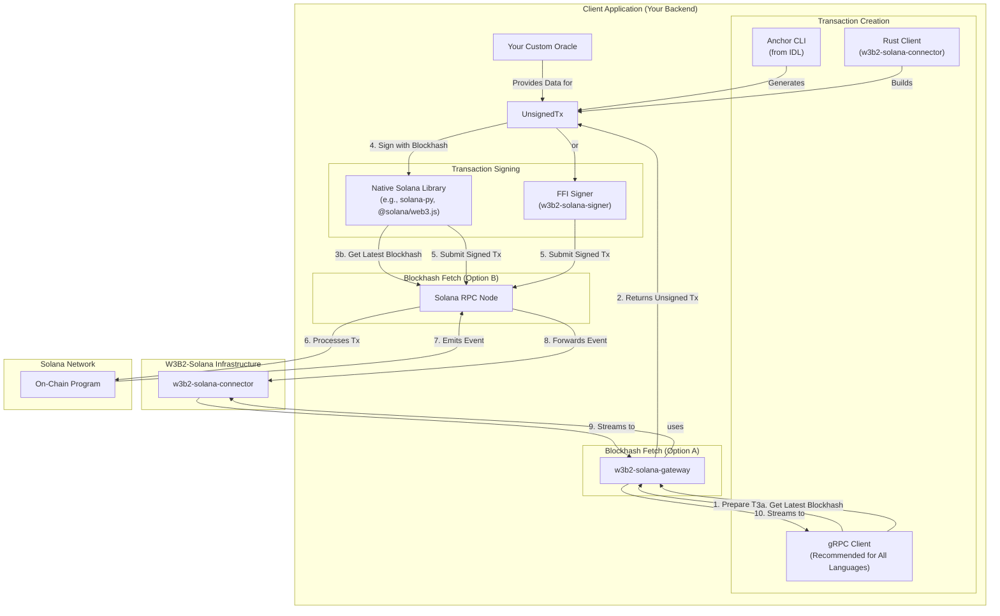

# Architecture Overview

The diagram below shows the interaction flow between the components.

```mermaid
graph TD
    subgraph "Client Application (Your Backend)"
        direction LR
        subgraph "Transaction Creation"
            A["Anchor CLI<br>(from IDL)"]
            B["Rust Client<br>(w3b2-solana-connector)"]
            C["gRPC Client<br>(Recommended for All Languages)"]
        end

        subgraph "Transaction Signing"
            D["Native Solana Library<br>(e.g., solana-py, @solana/web3.js)"]
            E["FFI Signer<br>(w3b2-solana-signer)"]
        end

        Oracle["Your Custom Oracle"]

        C -- "1. Prepare Tx" --> Gateway
        A -- "Generates" --> UnsignedTx
        B -- "Builds" --> UnsignedTx
        Gateway -- "2. Returns Unsigned Tx" --> UnsignedTx

        subgraph "Blockhash Fetch (Option A)"
            C -- "3a. Get Latest Blockhash" --> Gateway
        end

        subgraph "Blockhash Fetch (Option B)"
            D -- "3b. Get Latest Blockhash" --> RPC
        end

        UnsignedTx -- "4. Sign with Blockhash" --> D
        UnsignedTx -- "or" --> E
        Oracle -- "Provides Data for" --> UnsignedTx
    end

    subgraph "W3B2-Solana Infrastructure"
        Gateway["w3b2-solana-gateway"]
        Connector["w3b2-solana-connector"]
        Gateway -- "uses" --> Connector
    end

    subgraph "Solana Network"
        RPC["Solana RPC Node"]
        Program["On-Chain Program"]
    end

    D -- "5. Submit Signed Tx" --> RPC
    E -- "5. Submit Signed Tx" --> RPC

    RPC -- "6. Processes Tx" --> Program
    Program -- "7. Emits Event" --> RPC
    RPC -- "8. Forwards Event" --> Connector
    Connector -- "9. Streams to" --> Gateway
    Gateway -- "10. Streams to" --> C
```
