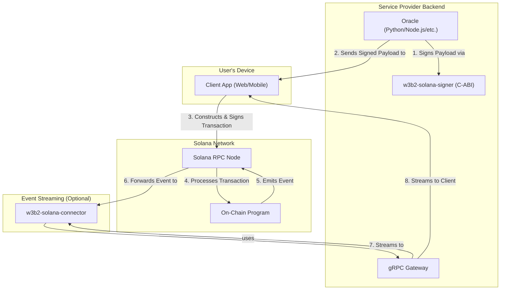

# High-Level Architecture

The W3B2-Solana toolset facilitates a clear separation of concerns between the user's client, the service provider's backend, and the Solana network.

The diagram below illustrates the flow for a typical paid, user-initiated command, leveraging the "developer-owned oracle" pattern.

### Component Roles

-   **Client Application**: The end-user's application (e.g., web, mobile). It is responsible for communicating with the service provider's Oracle to get signed data, constructing transactions using a standard library (like `@coral-xyz/anchor`), signing them with the user's wallet, and submitting them directly to a Solana RPC node.
-   **Oracle**: A backend service run by the developer. Its job is to enforce business logic (e.g., pricing, rate-limiting) and produce a signed data payload that authorizes a specific on-chain action. It can be written in any language.
-   **`w3b2-solana-signer`**: A C-ABI compatible Rust library that can be compiled into a shared object (`.so`, `.dll`, `.dylib`). It allows Oracles written in non-Rust languages to securely sign messages with a Solana keypair. It should only be used if a native keypair library is unavailable for the oracle's language.
-   **`w3b2-solana-program`**: The core on-chain Anchor program. It is the single source of truth, responsible for verifying the oracle's signature, enforcing rules, managing state, and transferring funds.
-   **`w3b2-solana-gateway`**: An optional gRPC server that provides a persistent, real-time stream of on-chain events to clients. Its sole responsibility is event streaming.
-   **`w3b2-solana-connector`**: The underlying Rust library that powers the gateway's event listening capabilities. It can also be used directly in Rust-based backend services.
-   **Solana RPC Node**: The public gateway to the Solana network. Both clients and the service provider's backend connect to an RPC node to send transactions and subscribe to account changes.