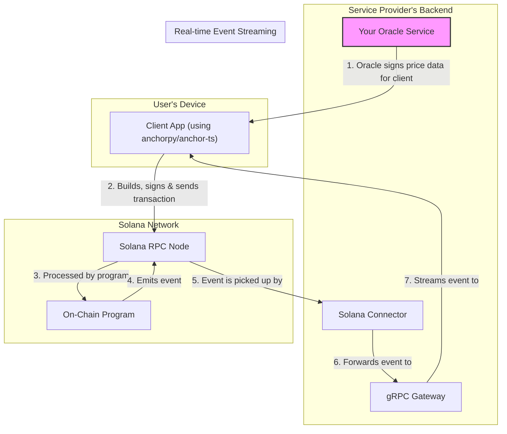

# High-Level Architecture Diagram

The system is composed of four main parts: the **Client**, the **gRPC Gateway**, the **Solana Connector**, and the **On-Chain Program**. The backend components (Gateway, Connector, and your custom Oracle) are managed by the service provider, while the client interacts with the user's wallet.

The diagram below illustrates the flow for a paid, user-initiated command. The client builds the transaction and sends it directly to the network, while the gateway streams events back.

### Component Roles

-   **Client**: Any application (web, mobile, desktop) that interacts with the service. It uses a library like `anchorpy` or `@coral-xyz/anchor` to build transactions, manages the user's wallet for signing, and sends them directly to a Solana RPC Node. It can also subscribe to the gRPC gateway for real-time events.
-   **gRPC Gateway**: Provides a persistent, real-time stream of on-chain events to clients. **This is its only role.**
-   **Solana Connector**: A Rust library that powers the gateway's event listening capabilities.
-   **Oracle Service**: A custom backend component, defined by the service provider, responsible for providing and signing dynamic data, such as the price of a command.
-   **On-Chain Program**: The Anchor smart contract that acts as the source of truth, enforcing rules and managing all on-chain state and fund transfers.
-   **Solana RPC Node**: The gateway to the Solana network itself.