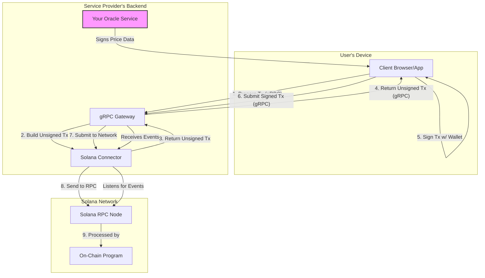

# High-Level Architecture Diagram

The system is composed of four main parts: the **Client**, the **gRPC Gateway**, the **Solana Connector**, and the **On-Chain Program**. The backend components (Gateway, Connector, and your custom Oracle) are managed by the service provider, while the client interacts with the user's wallet.

The diagram below illustrates the typical flow for a paid, user-initiated command.

### Component Roles

-   **Client**: Any application (web, mobile, desktop) that interacts with the service. It manages the user's wallet for signing transactions.
-   **gRPC Gateway**: The primary, language-agnostic entry point to the backend. It exposes the API for preparing and submitting transactions.
-   **Solana Connector**: A Rust library that handles the low-level details of building Solana transactions and listening for on-chain events.
-   **Oracle Service**: A custom backend component, defined by the service provider, responsible for providing and signing dynamic data, such as the price of a command.
-   **On-Chain Program**: The Anchor smart contract that acts as the source of truth, enforcing rules and managing all on-chain state and fund transfers.
-   **Solana RPC Node**: The gateway to the Solana network itself.